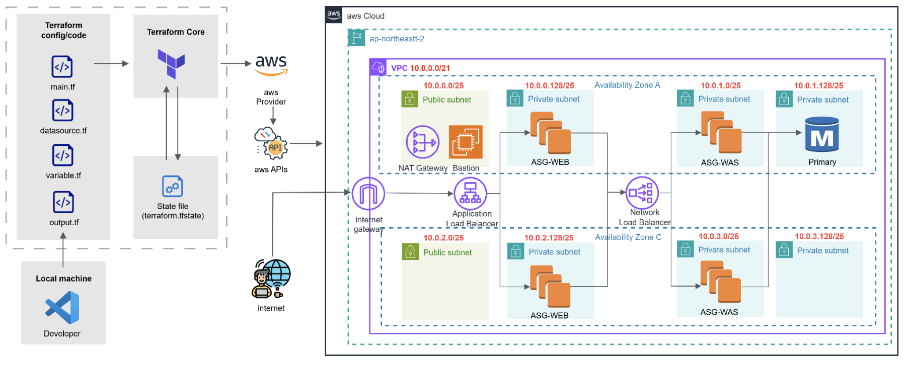

# 🐾 Petclinic on AWS with Terraform

## 📌 Overview
This project provisions the **Spring Petclinic application** on AWS using **Terraform**.  
It demonstrates Infrastructure as Code (IaC) with a modular design, separating **network, bastion host, load balancer, auto scaling groups, and database** into independent modules.  

---

## 🏗️ Architecture

**Main components:**
- **VPC & Subnets** – Public and private subnets across multiple Availability Zones  
- **Internet Gateway / NAT Gateway** – Handles inbound and outbound internet traffic  
- **Load Balancers** – ALB for Web tier, NLB for WAS tier  
- **Auto Scaling Groups** – For Web and WAS layers  
- **Database** – Primary database instance  
- **Bastion Host** – Secure administrative access  

---

## 📂 Project Structure
~~~text
njt-petclinic/
├── dev/                  # Parent modules (environment-specific)
│   ├── asg/              # Auto Scaling Groups
│   ├── bs/               # Bastion Host
│   ├── db/               # Database
│   ├── lb/               # Load Balancer
│   └── network/          # VPC, Subnets, Routing, SG
│
└── modules/              # Child modules (reusable building blocks)
    ├── asg/
    ├── bs/
    ├── db/
    ├── lb/
    └── network/
        ├── nat/
        ├── route/
        ├── sg/
        ├── snet/
        └── vpc/
~~~

- **Parent modules (dev/)**  
  Define environment-level configurations and call child modules.  
- **Child modules (modules/)**  
  Contain reusable Terraform code for each infrastructure component.  

---

## 🛠️ Tech Stack
- Terraform 
- AWS Provider ~> 5.0  
- AWS EC2, ALB, NLB, ASG, RDS  
- S3 Remote Backend for state management  

